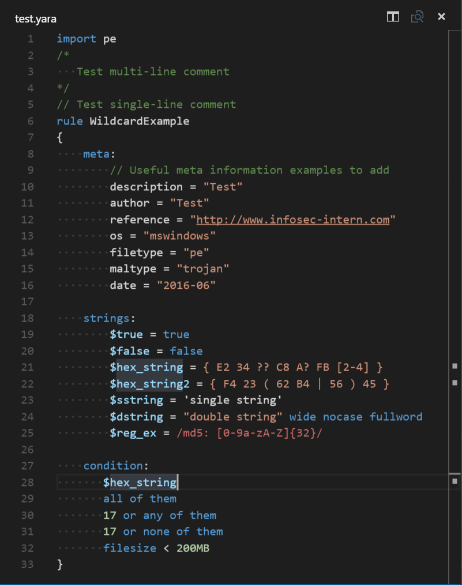

# textmate-yara
Syntax Highlighting for the YARA pattern matching language

## Installation
Copy the 'yara' directory into your $HOME/.vscode/extensions folder and restart Visual Studio Code

## Problems?
If you encounter an issue with the syntax, feel free to create an issue/pull request!
Alternatively, check out some of the YARA syntaxes for Sublime and Textmate (i.e. those in the <b>Example Code</b> section below).
They use the same syntax engine as VSCode and should work the same way

## Examples

## References
#### Syntax Reference: 
YARA : https://yara.readthedocs.io/

#### TextMate Docs: 
http://manual.macromates.com/en/language_grammars

#### Regular Expressions: 
http://www.regular-expressions.info/modifiers.html

#### Example Code: 
https://github.com/mmcgrana/textmate-clojure/blob/master/Syntaxes/Clojure.tmLanguage
https://github.com/textmate/python.tmbundle/blob/master/Syntaxes/Python.tmLanguage
https://github.com/nyx0/YaraSyntax/blob/master/yara.tmLanguage
https://github.com/blacktop/language-yara