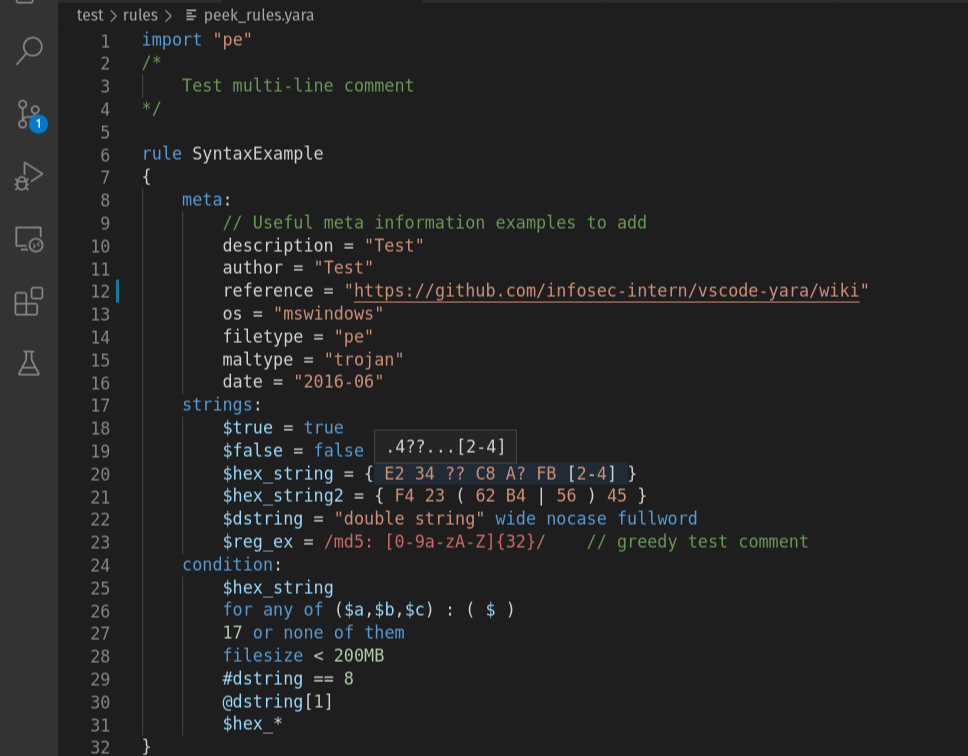

# YARA for Visual Studio Code
Language support for the YARA pattern matching language

Check out the [project wiki](https://github.com/infosec-intern/vscode-yara/wiki) for more information

## Screenshot

## Features
This extension provides many features common to code editors, such as

* [Rule and Identifier Definitions](https://github.com/infosec-intern/vscode-yara/wiki/Features#definitions)
* [Rule and Identifier References](https://github.com/infosec-intern/vscode-yara/wiki/Features#references)
* [Module Code Completion](https://github.com/infosec-intern/vscode-yara/wiki/Features#code-completion)
* [Hovers for Hex Strings](https://github.com/infosec-intern/vscode-yara/wiki/Features#hovers)

### Snippets
This extension provides some text snippets, which allows users to auto-complete certain common YARA rule patterns.

More information can be found on the [Snippets wiki page](https://github.com/infosec-intern/vscode-yara/wiki/Snippets).

## Problems?
If you encounter an issue with the syntax, feel free to create an issue or pull request!

Alternatively, check out some of the YARA syntaxes for Sublime and Atom, such as blacktop's excellent [language-yara syntax](https://github.com/blacktop/language-yara).

## YARA Documentation
https://yara.readthedocs.io/
